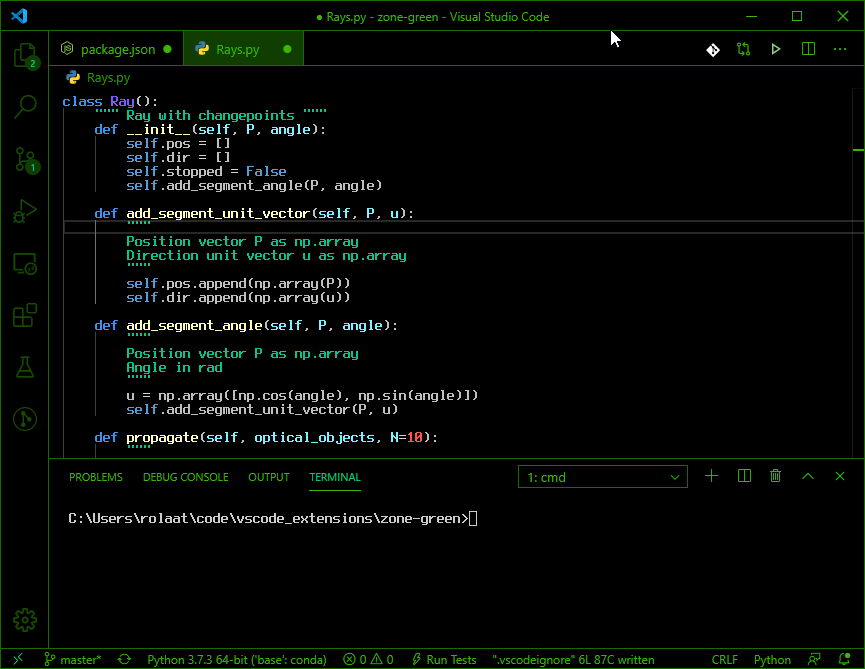

# Zone Green theme for VS Code

Retro, corny, but oddly satisfying theme for Visual Studio Code.
You may not be world's best hacker, but with this, nobody will notice.

While this theme wouldn't look out of place in your favorite 80s flick, it was also created to reduce the number of distractions, allowing you to get into the Zone more easily. The monochrome green colors of the interface and vibrant syntax coloring allow your to focus on what's important.

Recommended fonts:

- Fixedsys Excelsior (1st screenshot)
- Terminus TTF (2nd screenshot)

*Zone Green*

*Zone Green Mellow*

